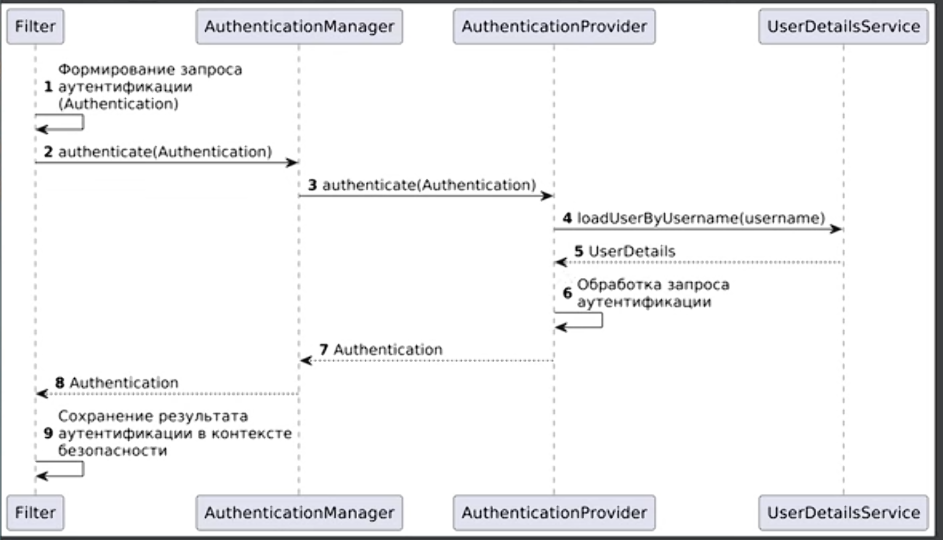

# Spring Security

## Для чего нужен?

Фреймворк для обеспечения безопасности в Java-приложениях, являющийся стандартом де-факто для экосистемы Spring.

## Самое важное

## Информация

### Filters

- **SecurityFilterChain** — это объект, который описывает, какие security-фильтры применять к HTTP-запросу и в каком порядке. Нужен, чтобы Spring Security мог перехватывать запрос до контроллера и выполнять аутентификацию, авторизацию, CSRF, CORS и т.д.

- Много фильтров ставят через конфиг `HttpSecurity`, а если нужен свой — добавляют через `addFilterBefore`, `addFilterAfter` или `addFilterAt`. Можно иметь и несколько `SecurityFilterChain`, если для разных URL нужны разные наборы правил и фильтров.

- **AuthenticationFilter** — это security-фильтр, который достаёт данные для входа из запроса (логин/пароль, токен и т.п.), создаёт `Authentication` и отправляет его в `AuthenticationManager`. Можно явно указывать порядок фильтров.

### AuthenticationManager

`AuthenticationManager` — это компонент, который принимает `Authentication` и решает, можно ли аутентифицировать пользователя, обычно делегируя проверку одному или нескольким `AuthenticationProvider`; при успехе он возвращает уже заполненный `Authentication` (новый).

### AuthenticationProvider

`AuthenticationProvider` — это компонент, который умеет проверять конкретный тип аутентификации и при успехе возвращает заполненный `Authentication`; например, один провайдер может проверять `username/password`, другой — `JWT`. Несколько провайдеров ставят не "рядом сами по себе", а регистрируют в `AuthenticationManager` (`ProviderManager`), где они опрашиваются по очереди.

- Умеет работать с конкретным типом объектов, имплементирующим `Authentication`.
- В нем есть метод аутентификации, но он работает только с одним типом аутентификации, то есть вы можете реализовывать разные сценарии аутентификации в их собственных классах.
- То есть у `AuthenticationProvider`-ов есть метод `authenticate()`: они могут произвести успешную аутентификацию, выбросить `AuthenticationException` или сообщить нам, что аккаунт заблокирован.
- Иногда текущий `AuthenticationProvider` не знает, что делать с полученными данными, и возвращает `null`, чтобы мы могли передать решение этого вопроса другому провайдеру.

### UserDetailsService

`UserDetailsService` — это интерфейс, который загружает данные пользователя по `username`; Spring Security использует его как `user DAO`, чаще всего через `DaoAuthenticationProvider`, чтобы получить логин, пароль и роли.

Свой сервис делают так: реализуют `loadUserByUsername(String username)`, внутри ищут пользователя в БД/другом источнике и возвращают `UserDetails` (например, `org.springframework.security.core.userdetails.User` или свою реализацию).

### SecurityContextHolder

`SecurityContextHolder` — это место, где Spring Security хранит текущий `SecurityContext`, а внутри него лежит `Authentication` текущего пользователя; обычно контекст доступен в пределах текущего потока выполнения. В контроллере можно получить имя текущего пользователя через `SecurityContextHolder.getContext().getAuthentication().getName()`, если пользователь уже аутентифицирован.

## Интересные статьи

[Плейлист на ютубе](https://www.youtube.com/watch?v=If3YIcLZ7sc&list=PLs_aLxm3VDLu9ghcQhTHOT84zmqLgAwdL)
